# PaperBrain

**Chat with your documents.** Upload PDFs, paste web URLs or YouTube links, and ask questions — PaperBrain retrieves the most relevant passages and generates grounded answers with source citations.



---

## Features

- **Multi-source ingestion** — PDFs, web pages, and YouTube transcripts
- **Conversational memory** — multi-turn chat with context retention across the session
- **Source citations** — every answer cites the document, page, or URL it came from
- **Confidence scoring** — color-coded badge on every response (🟢 ≥80% · 🟡 55–79% · 🔴 <55%)
- **Dual LLM** — Google Gemini 2.5 Flash (primary) or Groq Llama 3.3 70B, switchable at any time
- **Persistent vector store** — ChromaDB on disk; re-ingesting appends without overwriting
- **Modern web UI** — dark-theme single-page app served by Flask; no Streamlit required

---

## Tech Stack

| Layer | Technology |
|---|---|
| Web server | Flask 3 |
| Orchestration | LangChain (LCEL) |
| LLM — primary | Google Gemini 2.5 Flash (`langchain-google-genai`) |
| LLM — fallback | Groq Llama 3.3 70B (`langchain-groq`) |
| Embeddings | Google `gemini-embedding-001` |
| Vector store | ChromaDB |
| PDF loader | PyMuPDF |
| Web loader | LangChain `WebBaseLoader` |
| YouTube loader | `youtube-transcript-api` / `YoutubeLoader` |

---

## Project Structure

```
PaperBrain/
├── .env                  # API keys (not committed)
├── requirements.txt
├── app.py                # Flask server + JSON API
├── ingest.py             # Ingestion pipeline (also usable as CLI)
├── rag_chain.py          # RAG chain, retriever, ask() helper (also usable as CLI)
├── templates/
│   └── index.html        # Single-page dashboard
├── static/
│   ├── css/app.css       # Dark-theme stylesheet
│   └── js/app.js         # SPA frontend logic
├── data/                 # Drop PDFs here for CLI ingestion
└── chroma_db/            # Auto-created by ChromaDB after first ingest
```

---

## Setup

### 1. Clone & create a virtual environment

```bash
git clone https://github.com/your-org/PaperBrain.git
cd PaperBrain

python -m venv .venv

# Windows
.venv\Scripts\activate
# macOS / Linux
source .venv/bin/activate
```

### 2. Install dependencies

```bash
pip install -r requirements.txt
```

### 3. Configure API keys

Create a `.env` file in the project root:

```env
GEMINI=your_gemini_api_key
GROQ=your_groq_api_key
```

- **Gemini key** — [Google AI Studio](https://aistudio.google.com/app/apikey)
- **Groq key** — [Groq Console](https://console.groq.com/keys)

---

## Running the App

```bash
python app.py
```

Then open **http://localhost:5000** in your browser.

The server auto-loads your existing ChromaDB on first request if one is already present — no manual reload needed.

---

## Usage

### Web UI

1. Click **Add Sources** to open the ingestion drawer.
2. Drag-and-drop PDFs or paste a web/YouTube URL and click **Ingest**.
3. Once the status bar shows **Ready**, type a question in the chat composer and press Enter.
4. Switch between Gemini and Groq using the provider toggle in the top bar.

### CLI — Ingest documents

```bash
# PDF
python ingest.py path/to/document.pdf

# Web page
python ingest.py https://example.com/article

# YouTube video
python ingest.py https://www.youtube.com/watch?v=VIDEO_ID
```

### CLI — Interactive chat

```bash
python rag_chain.py
```

---

## API Reference

The Flask server exposes a simple JSON API used by the frontend:

| Method | Endpoint | Description |
|---|---|---|
| `GET` | `/` | Serves the dashboard |
| `GET` | `/api/status` | Returns chain state, provider, chunk count, message history |
| `POST` | `/api/reload` | Rebuilds the RAG chain from the existing vector store |
| `POST` | `/api/provider` | Switches LLM provider (`{"provider": "gemini" \| "groq"}`) |
| `POST` | `/api/upload` | Uploads and ingests one or more PDF files |
| `POST` | `/api/ingest-url` | Ingests a web page or YouTube URL (`{"url": "..."}`) |
| `POST` | `/api/chat` | Sends a message (`{"message": "..."}`) and returns the answer |
| `POST` | `/api/clear` | Clears the conversation history |

---

## How It Works

1. **Ingest** — documents are loaded, split into 800-token chunks (80 overlap), embedded with Google's embedding model, and stored in ChromaDB.
2. **Retrieve** — at query time, the top-3 most relevant chunks with a similarity score ≥ 0.50 are fetched.
3. **Generate** — the RAG chain passes the retrieved context and the last 3 turns of chat history to the LLM, which is instructed to answer only from context and cite sources.
4. **Display** — the SPA renders the answer with a confidence badge and source citation pills.

---

## Notes

- YouTube ingestion requires the video to have captions/transcripts enabled.
- ChromaDB data persists across restarts; delete `./chroma_db` to start fresh.
- Temperature is set to `0.2` on both LLMs for consistent, factual responses.
- The optional `EMBEDDING_PROVIDER=ollama` env var switches embeddings to a local Ollama model (requires `ollama pull nomic-embed-text`).
- Set `SECRET_KEY` in `.env` for a stable Flask session secret in production.
